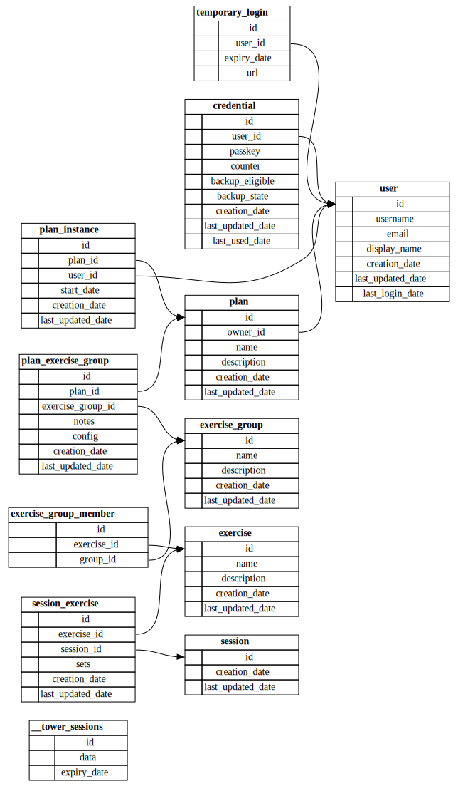

# eggercise.rs

## Dependencies 
- C++ compiler (for wasm-opt). G++ and Clang both work but the g++ version needs to be at least 17 which isn't in some OS apt repos yet. `apt install clang`
- OpenSSL v3.x `apt install libssl-dev`

## Docs

[Code docs](https://cs2dsb.github.io/eggercise.rs)

## TODO
- [ ] Solution for leptos routes working offline in the service worker
    - /* -> index?
    - Included in package generated from shared crate?
- [x] ~~Modify service setup so releases are in versioned folders rather than just the main binary (so assets are versioned too)~~ (Update it to docker)
- [x] Improve client-server error situation (see api.rs)
    - It could possibly be simplified. Try using it and see if there is actually any benefit to the enum variants over just returning a string
- [ ] The service worker mapping unknown URLs to index isn't working in FF
- [x] Macro to generate `all_columns` for Iden structs. Failing that a test that checks against a hard-coded list to prevent it going out of sync
- [x] Add postcss step to CI build
- [ ] Add "Loading..." for the first ping (Currently if you refresh on a page with an offline fallback it flashes up the OFFLINE message for a second)
- [ ] Tweak build.rs bundle creation to only include a subset of files (maybe a blocklist?). Motivation: don't want to include all the font README/licence/etc
- [ ] Generate the preload/prefetch link tags instead of manually maintaining them
- [ ] Investigate cleaning up action errors (can they work inside ErrorBoundaries instead of an extra error signal?)
- [ ] Model last_updated_date should be handled consistently (if it's even needed)
- [ ] Test what happens when there's an error from a DELETE request (error body?)

## WebauthN 
- [x] Register
- [x] Login
- [x] Add Key
- [x] Temporary login via QR code
    - [x] Add key from new device

## Docker build
- [x] Mount sqlite db 

## Potentially useful crates

- https://crates.io/crates/leptos-struct-table
- https://crates.io/crates/leptos_icon_gen
- https://crates.io/crates/leptos_webtransport
- https://crates.io/crates/rcss-leptos
- https://crates.io/crates/leptos-chartistry
- https://crates.io/crates/leptos_form
- https://thawui.vercel.app/components/calendar

## Database 

